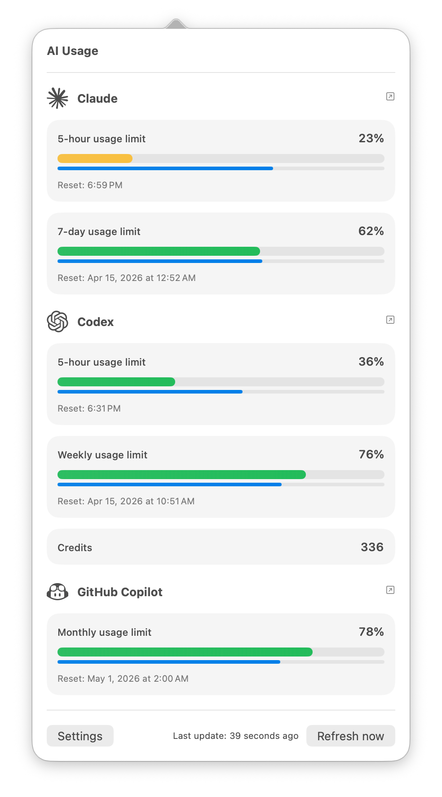

# AI Usage App

Native macOS menu bar app for tracking remaining Claude, Codex, and GitHub Copilot usage.

`AI Usage` is the user-facing app name. `AiUsageApp` is the Swift package, executable target, and Xcode scheme name.




## Features

- Native macOS status item with a left-click usage panel and right-click quick actions.
- Separate Claude, Codex, and GitHub Copilot providers behind a shared provider abstraction.
- Codex tracking for 5-hour usage, weekly usage, and credits.
- Claude tracking for 5-hour usage and 7-day usage.
- GitHub Copilot monthly quota tracking.
- Configurable refresh cadence, visible providers, language, and which Claude and Codex percentages appear in the menu bar.
- Local notifications for ahead-of-schedule usage, behind-schedule usage, and early Codex resets.
- Keychain-backed credential storage plus persisted snapshots, preferences, and diagnostic logs.
- English and Polish UI support.
- Settings tabs for Accounts, Display, Notifications, Logs, and About.

## Data Sources

- Codex uses the local Codex CLI auth stored in `~/.codex/auth.json` or `$CODEX_HOME/auth.json`, then fetches usage directly from the Codex usage API.
- Claude uses the local Claude Code OAuth auth from Keychain or `~/.claude/.credentials.json`, then fetches usage directly from Anthropic's OAuth usage API.
- GitHub Copilot uses GitHub OAuth device flow, stores the resulting GitHub token in Keychain, and fetches usage from GitHub's Copilot internal API.

## Requirements

- macOS 15 or newer
- Xcode 16 or newer
- Swift 6 or newer

## Build, Test, And Run

### Xcode

1. Open the package root in Xcode.
2. Select the `AiUsageApp` scheme.
3. Run the app.

### SwiftPM

```bash
swift build
swift test
swift run AiUsageApp
```

### Standalone `.app` Bundle

```bash
./scripts/build-app.sh
open '.build/AI Usage.app'
```

The packaging script creates a lightweight menu bar app bundle with `LSUIElement=1`, so the app runs without a Dock icon.

## Authentication

### Codex

1. Run `codex login` in Terminal.
2. Open or refresh `Settings > Accounts`.
3. The app will detect your local Codex CLI auth automatically.

### GitHub Copilot

1. Open `Settings > Accounts`.
2. Click `Sign in to GitHub`.
3. Your browser opens GitHub's device-flow page.
4. Enter the code shown by the app and finish the sign-in flow.

The app stores the resulting GitHub OAuth token in Keychain and uses it for Copilot usage requests.

### Claude

1. Run `claude` in Terminal and complete Claude Code sign-in.
2. Open or refresh `Settings > Accounts`.
3. The app will detect your local Claude Code auth automatically.

## Notifications

- Ahead-of-schedule alerts fire when remaining usage is materially below the time-adjusted expected remaining amount.
- Behind-schedule alerts fire when remaining usage is materially above the expected remaining amount for supported windows.
- Codex early reset alerts fire when a Codex 5-hour or weekly reset appears to happen earlier than previously observed.

The alert evaluator uses hysteresis and re-arming so the app does not spam notifications when usage hovers near a threshold.

## Settings Overview

- `Accounts`: manage Claude, Codex, and GitHub Copilot authentication.
- `Display`: choose language, refresh interval, visible providers, and the Claude and Codex menu bar metrics.
- `Notifications`: enable or disable pace and reset alerts.
- `Logs`: inspect, copy, and clear persisted diagnostic logs.
- `About`: show the current app version.

## Notes

- The menu bar shows one percentage per visible provider, ordered alphabetically.
- Codex credits are shown in the panel, but not in the menu bar summary.
- Providers are visible by default unless they are explicitly hidden in settings.
- If a metric has no known reset timestamp, the panel omits the reset line instead of inventing one.
- Right-click the menu bar item for direct `Refresh`, `Settings`, and `Quit` actions.

## Legal

The OpenAI logo, Claude logo, and GitHub Copilot logo are used only to identify their respective services. All trademarks, service marks, and logos are the property of their respective owners. This project is independent and is not affiliated with, endorsed by, or sponsored by OpenAI, Anthropic, or GitHub.

## Docs

- See `Docs/ARCHITECTURE.md` for the current package layout and runtime design.
- See `Docs/TEST_STRATEGY.md` for the current automated and manual testing strategy.
