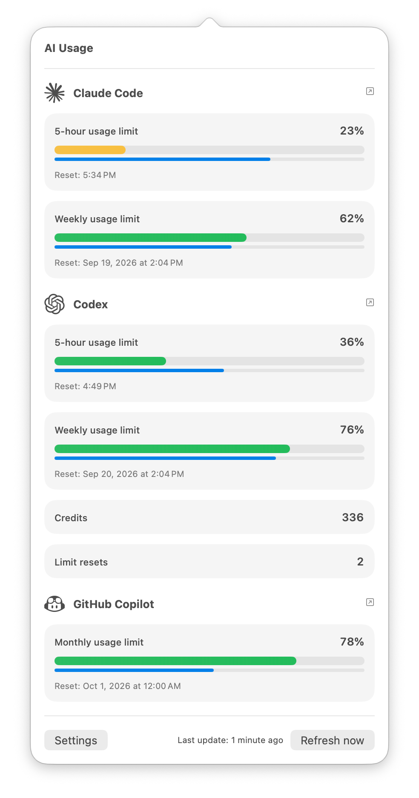

# AI Usage App

Native macOS menu bar and Windows 11 system-tray apps for tracking remaining Claude, Codex, and GitHub Copilot usage.




## Features

- Native platform experiences:
  - A macOS menu bar item and Windows 11 provider icons in the system tray.
  - Left click opens a compact transient usage panel; right click exposes quick actions.
  - A separate settings window for Accounts, Appearance, Notifications, Logs, and About.
- Usage tracking:
  - Separate Claude, Codex, and GitHub Copilot providers behind a shared provider abstraction.
  - Codex tracking for 5-hour and weekly usage, GPT-5.3-Codex-Spark limits, credits, and available limit resets.
  - Claude tracking for 5-hour usage and 7-day usage.
  - GitHub Copilot monthly quota tracking.
- Customization and alerts:
  - Configurable refresh cadence, panel background and bar colors, menu bar/system-tray providers, usage panel providers, language, and displayed Claude and Codex percentages.
  - Local notifications for ahead-of-schedule usage, behind-schedule usage, and early or scheduled Codex and Claude resets.
- Privacy and persistence:
  - Keychain on macOS and Windows Credential Manager on Windows for the GitHub OAuth token.
  - Platform-native settings, snapshot, and diagnostic-log storage.
- Localization:
  - UI support for English, Polish, Spanish, German, French, Japanese, and Brazilian Portuguese.

## Requirements

- macOS 15 or newer, or
- Windows 11 on ARM64 or x64

## Download And Install

Prebuilt macOS DMG and portable Windows ZIP files are available on the GitHub [Releases](https://github.com/wojtekmaj/ai-usage/releases) page.

### macOS

Typical install flow:

1. Download the latest DMG from GitHub Releases.
2. Open the DMG.
3. Drag `AI Usage.app` to `/Applications`.
4. Launch the app from Applications.

### Windows 11

1. Download the Windows ZIP matching your PC's architecture: `windows-arm64.zip` or `windows-x64.zip`.
2. Extract the entire ZIP to a writable folder; keep all files together.
3. Run `AI Usage.exe`. No Visual Studio, .NET runtime, or Windows App SDK installation is required.
4. Windows may initially place the provider icons in the tray overflow menu (`^`). Drag them next to the battery if you want them always visible.

The portable build is unsigned. If SmartScreen warns on first launch, choose **More info**, verify that the file came from this repository's release, and choose **Run anyway**.

## Gatekeeper And First Launch

Current GitHub release builds are not Developer ID-signed or notarized. Because of that, macOS Gatekeeper may block the first launch of a downloaded copy even though the app bundle inside the DMG has an ad hoc signature.

If macOS says the app cannot be opened because the developer cannot be verified, use one of these options:

1. In Finder, open `/Applications`, Control-click `AI Usage.app`, choose `Open`, then confirm `Open` in the dialog.
2. Or remove the quarantine attribute in Terminal:

   ```bash
   xattr -dr com.apple.quarantine "/Applications/AI Usage.app"
   ```

After the first successful launch, later launches should work normally.

## Authentication

### Codex

1. If you use the Codex desktop app, make sure you are signed in there.
2. If you use Codex CLI instead, run `codex login` in Terminal.
3. Open or refresh `Settings > Accounts`.
4. The app will detect your local Codex auth automatically.

### GitHub Copilot

1. Open `Settings > Accounts`.
2. Click `Sign in to GitHub`.
3. Your browser opens GitHub's device-flow page.
4. Enter the code shown by the app and finish the sign-in flow.

The app stores the resulting GitHub OAuth token in Keychain on macOS or Windows Credential Manager on Windows and uses it for Copilot usage requests.

### Claude

1. Run `claude` in Terminal and complete Claude Code sign-in.
2. Open or refresh `Settings > Accounts`.
3. The app will detect your local Claude Code auth automatically.

## Data Sources

- Codex uses local Codex auth stored in `~/.codex/auth.json` or `$CODEX_HOME/auth.json`, which can be created by signing in to the Codex desktop app or by running `codex login` for Codex CLI. The shared Rust core reads it and fetches usage from the Codex usage API.
- Claude uses local Claude Code OAuth auth from Keychain on macOS or `~/.claude/.credentials.json`. The platform shell passes the credentials to the shared Rust core, which fetches usage from Anthropic's OAuth usage API.
- GitHub Copilot uses GitHub OAuth device flow and stores the resulting token in the platform credential vault. The platform shell passes the token to the shared Rust core, which fetches usage from GitHub's Copilot internal API.

## Notifications

- Ahead-of-schedule alerts fire when remaining usage is materially below the time-adjusted expected remaining amount.
- Behind-schedule alerts fire when remaining usage is materially above the expected remaining amount for supported windows.
- Codex early reset alerts fire when a Codex 5-hour or weekly reset appears to happen earlier than previously observed.

The alert evaluator uses hysteresis and re-arming so the app does not spam notifications when usage hovers near a threshold.

## Settings Overview

- `Accounts`: manage Claude, Codex, and GitHub Copilot authentication.
- `Appearance`: choose language, refresh interval, panel background, bar colors, which providers appear in the menu bar/system tray and usage panel, optional Codex metrics, and the Claude and Codex summary percentages.
- `Notifications`: enable or disable pace and reset alerts.
- `Logs`: inspect, copy, and clear persisted diagnostic logs.
- `About`: show the current app version.

## Notes

- macOS shows one percentage per visible provider in the menu bar. Windows exposes one icon per visible provider with the selected percentage in its tooltip; icons are ordered alphabetically when Windows permits it.
- The usage panel shows cards only for the providers enabled in settings, ordered alphabetically.
- Codex credits and available limit resets are optional panel metrics and do not appear in the menu bar/system-tray summary.
- Providers are visible by default in both places unless they are explicitly hidden in settings.
- If a metric has no known reset timestamp, the panel omits the reset line instead of inventing one.
- Right-click the menu bar or system-tray item for direct `Refresh`, `Settings`, and `Quit` actions.

## Docs

- See [CONTRIBUTING.md](CONTRIBUTING.md) for local development, testing, and packaging.
- See [Docs/ARCHITECTURE.md](Docs/ARCHITECTURE.md) for the package layout and runtime design.
- See [Docs/TEST_STRATEGY.md](Docs/TEST_STRATEGY.md) for automated and manual verification guidance.
- See [Docs/RELEASING.md](Docs/RELEASING.md) for tag-driven release publishing.

## Legal

The OpenAI logo, Claude logo, and GitHub Copilot logo are used only to identify their respective services. All trademarks, service marks, and logos are the property of their respective owners. This project is independent and is not affiliated with, endorsed by, or sponsored by OpenAI, Anthropic, or GitHub.
